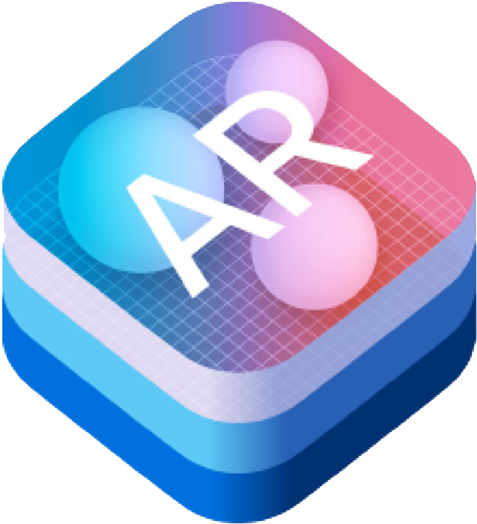

 

<!-- Animated line -->

<!--Cover Photo -->

<!-- Macbook home Photo-->

<!--1st Main Heading-->
<h1 align="center">Hi , I'm Shashika Theekshana</h1>

 <!-- 2nd Sub Heading-->
<h3 align="center">A passionate iOS app developer from Sri Lanka.</h3>

<!-- Slidhing blue text-->
 

## </img> About Me
<!-- Animated green line-->

<!--   -->
  
- :school: I'm an Undergraduate Student [FACULTY OF TECHNOLOGICAL STUDIES](https://fts.vau.ac.lk) in [UOV](https://vau.ac.lk)
  
- :email: Reach me at [wpshashikatheekshana@gmail.com](wpshashikatheekshana@gmail.com)
  

<!--- 🔭 I’m currently working in <a href="https://phoenix.tech/griffyn/" target="blank">Griffyn Robotech Private Limited</a>-->

- 🌱 I’m currently working on a Mobile App(Swift)

<!-- - 🤝 I’m available for freelancing. -->

- 🌱 I’m currently learning Meta iOS Developer Course  <!--  <a href="https://github.com/100rabhcsmc/100DaysOfSwift" target="blank">100DaysOfSwift</a> -->

<!-- - 📝 I regularly write articles on [https://dev.to/100rabhcsmc](https://dev.to/100rabhcsmc) -->

- 💬 Ask me about **Swift , SwiftUI & SwiftData **

- 📫 How to reach me **wpshashikatheekshana@gmail.com**

<!-- - 📄 Know about my experiences <a href="https://github.com/100rabhcsmc/Me.io/blob/master/01SaurabhChavanReactNativeResume.pdf" target="blank">Resume</a> -->
 

<!-- Animated green line-->

<!-- Tech Stack -->
<h2 align="left">🔧 Tech Stack</h2>  

  
📱 Native iOS Development Tools
 

  

  <table style="border-collapse: collapse; border: 1px solid #ccc; width: auto; margin: 0 auto;">
    <tr>
      <td style="text-align: center;">
         
        
Swift

      </td>
      <td style="text-align: center;">
         
        
SwiftUI

      </td>
      <td style="text-align: center;">
         
        
ARKit

      </td>
      <td style="text-align: center;">
         
        
CoreML

      </td>
      <td style="text-align: center;">
         
        
Xcode

      </td>
      <td style="text-align: center;">
         
        
Git

      </td>
    </tr>
    <tr>
      <td style="text-align: center;">
         
        
Firebase

      </td>
      <td style="text-align: center;">
         
        
Figma

      </td>
      <td style="text-align: center;">
         
        
CreateML

      </td>
      <td style="text-align: center;">
         
        
SwiftData

      </td>
      <td style="text-align: center;">
         
        
SwiftTesting

      </td>
      <td style="text-align: center;">
         
        
TestFlight

      </td>
    </tr>
  </table>

    

  
⚙️ Core Technical Skills 
 

  

  <table style="border-collapse: collapse; border: 1px solid #ccc; width: auto; margin: 0 auto;">
    <tr>
      <td style="text-align: center;">
         
        
Swift

      </td>
      <td style="text-align: center;">
         
        
SwiftUI

      </td>
      <td style="text-align: center;">
         
        
ARKit

      </td>
      <td style="text-align: center;">
         
        
CoreML

      </td>
      <td style="text-align: center;">
         
        
Xcode

      </td>
      <td style="text-align: center;">
         
        
Git

      </td>
      <td style="text-align: center;">
         
        
Firebase

      </td>
      <td style="text-align: center;">
         
        
Figma

      </td>
      <td style="text-align: center;">
         
        
CreateML

      </td>
      </tr>
  </table>

  

<h3 align="left" > Connect with me </h3>

<h3 align="left">
  Connect with me
</h3>

  
  
  
  
  
  
  
  
  
  
  

